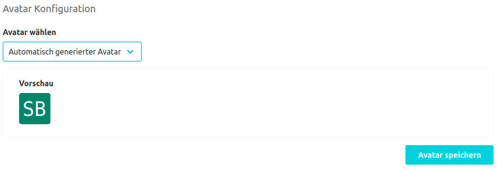
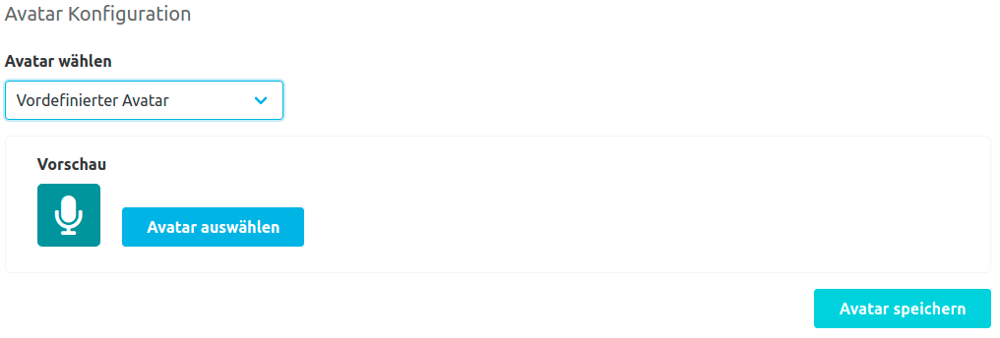
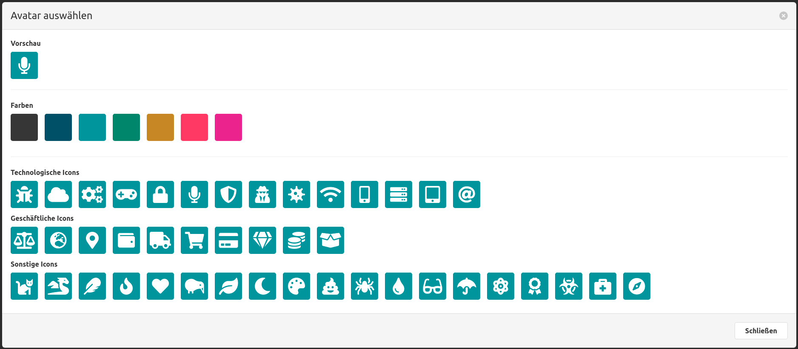
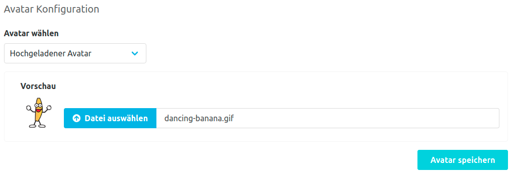

Das Repository Avatar Plugin erlaubt es unterschiedliche Typen von Avataren für Repositories zu vergeben.

Der Standard Avatar ist automatisch generiert.
Er wird aus den Anfangsbuchstaben des Namespaces und des Repository mit einer zufälligen Farbe erstellt.

Als weitere Avatar Option kann ein Paar aus vordefinierten Icons und Farben gewählt werden.

Die dritte Art von Avataren sind hochgeladene Bilddateien. 
Dabei gibt es zu beachten, dass die Dateigröße beim Hochladen 5 MB nicht überschreiten darf 
und dass die Bilddatei für die Anzeige auf 64 x 64 Pixel skaliert wird.
Unterstützt werden die Bildformate: jpg, jpeg, png, gif, svg

