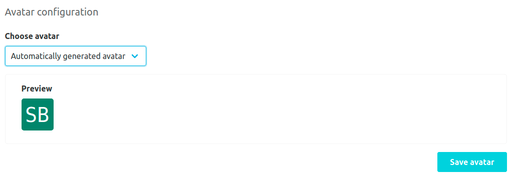
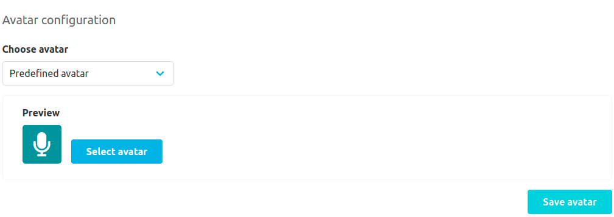
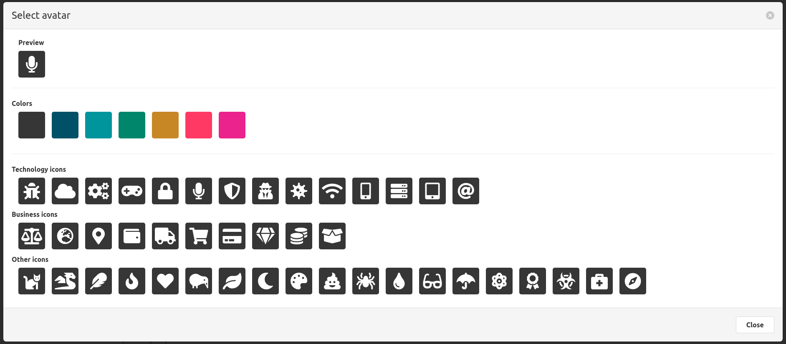
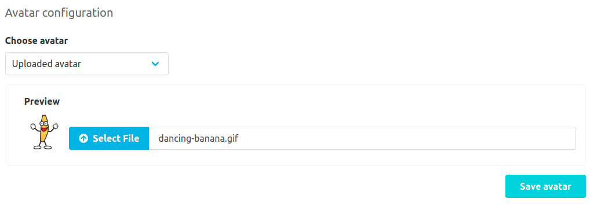

The repository avatar plugin allows to assign different types of avatars for repositories.

The default avatar is an automatically generated one.
It is created from the first letters of the namespace and the repository with a random color.

As another avatar option a pair of predefined icons and colors can be chosen.

The third type of avatars are uploaded image files.
Please note that the file size must not exceed 5 MB when uploaded
and that the image file is scaled to 64 x 64 pixels for display.

Supported image formats are: jpg, jpeg, png, gif, svg

